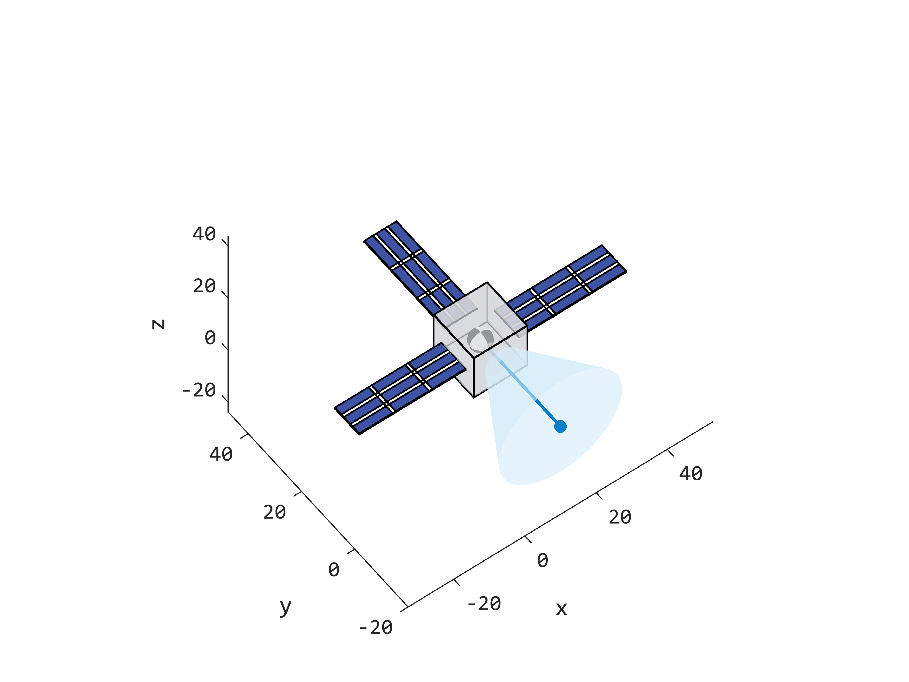

# Satellite-Visualization-Toolbox

This is a project of visual mapping of satellite attitude position, based on MATLAB 2021b.

Some common properties for satellite model are given as port in high-level class constructors. 

Support setting satellite model shape, size, components, line width, color in graphics and other attributes would be added in future version. 

The print effect in Figure show below.

